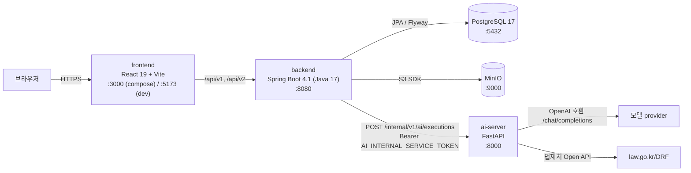

# As-Built Architecture (실제 동작 구조)

- Status: **AS_BUILT** — 코드에서 직접 읽어 정리한 것. 목표(Target) 문서가 아니다.
- Code Baseline: `9ea9975` (origin/main, 2026-08-04 확인)
- 짝 문서: [AI 모듈 통합 가이드](AI_MODULE_INTEGRATION_GUIDE.md) — 새 AI 기능을 끼워 넣는 절차

> **우선순위:** 이 문서(As-built) < 코드. 충돌하면 코드가 맞다.
> 같은 폴더의 `SYSTEM_ARCHITECTURE.md`·`AI_SERVER_BOUNDARY.md`·`SPRING_WAS_BOUNDARY.md`는
> **TARGET_CANONICAL**(목표)이며 `Implementation Status: NOT_STARTED/PARTIAL`이 붙어 있다.
> "이렇게 되어야 한다"와 "지금 이렇다"를 섞지 말 것.

---

## 1. 프로세스와 포트



**금지된 연결** (코드로 강제되고 있음):
- 프론트 → AI 서버 직접 호출 (AI 서버에는 브라우저용 public endpoint가 없다)
- AI 서버 → DB / Object Storage (AI 서버에 드라이버·SDK 자체가 없다)
- AI 서버가 받는 것은 **Spring이 추출한 텍스트뿐** — 파일 bytes·presigned URL·JWT·엔티티 직렬화 금지

**기동**: `compose.yaml` — postgres → minio → minio-init → ai-server → backend → frontend 순으로
healthcheck 의존. 필요한 환경변수는 `.env.example` 참조 (`AI_PROVIDER`·`AI_API_KEY`·`AI_MODEL`·
`AI_INTERNAL_SERVICE_TOKEN`·`JWT_SECRET`·`POSTGRES_PASSWORD`·`MINIO_ROOT_PASSWORD`는 **필수**,
없으면 compose가 뜨지 않는다).

---

## 2. 사용자 여정(Journey) — 이 제품이 실제로 하는 일

라우트는 `frontEnd/src/app/router/AppRouter.jsx`가 정본이다. 현재 제품은 **하나의 선형 여정**이다:

칸의 정본은 `ProjectModuleStatusService.findAll()` 이 돌려주는 **여덟 개**이고,
`PipelineModuleType` 열거 순서와 같다. 실스택으로 확인함(2026-08-11).

| # | 화면 | 라우트 | `PipelineModuleType` | AI TaskType |
|---|---|---|---|---|
| 1 | 아이디어 | `…/idea` | `IDEA` | `IDEA_BRIEF_DERIVATION` |
| 2 | 사업안(생성·비교·선택) | `…/concepts` (+`/compare` 는 같은 화면의 비교 모드) | `CONCEPT_PORTFOLIO` | `CONCEPT_PORTFOLIO_V2_{RUN,CONTINUE,SELECTION_ACTION}` |
| 3 | 시장 분석 | `…/market` | `MARKET_ANALYSIS` | `MARKET_RESEARCH`(mode=FULL) |
| 4 | BM 분석 | `…/business-model` | `BUSINESS_MODEL` | `MARKET_RESEARCH`(mode=BM) |
| 5 | 기술·운영 | `…/tech-ops` | `TECH_OPS` | `TECH_OPS_PROPOSAL` |
| 6 | 재무 | `…/finance` | `FINANCE` | `FINANCE_ESTIMATE` |
| 7 | 패널 트윈 조사 | `…/panel-survey` | `PANEL_SURVEY` | `TWIN_SURVEY`, `TWIN_STIMULUS_DRAFT` |
| 8 | 마케팅 콘텐츠 | `…/marketing` | `MARKETING` | `MARKETING_CONTENT_GENERATION` |

각 단계는 **앞 단계의 확정 산출물을 입력으로 요구**한다. 게이트의 정본은
`ProjectModuleStatusService.findAll()` 한 메서드다 — 상태가 이상하면 거기부터 읽는다.

> ⚠ 두 칸은 게이트 규칙이 다르다. **시장 분석·BM 은 실행이 있으면 Seed 확정 여부와 무관하게
> 그 실행 상태를 보여준다**(`researchOrGate`). 견본 컨셉으로도 돌 수 있어서, Seed 로 막으면
> 다 끝난 모듈이 「준비 전」으로 보이는 거짓말이 된다.

> ⚠ `PipelineModuleType` 에는 여정에 안 나오는 `CONCEPT_FACTORY`·`CONCEPT_SELECTION` 이
> 아직 남아 있다(옛 컨셉 모듈). 프론트는 셋 다 `concepts` 한 칸으로 접는데,
> `Object.fromEntries` 라 **열거 순서의 마지막이 이긴다**.

### 죽은 화면 — 라우트만 남고 전부 리다이렉트

`AppRouter.jsx` 82–134행이 옛 경로를 전부 journey로 넘긴다.
`plan/`·`structured-plan`·`review/legal`·`review/financial`·`validate/*`·`report` 등.
대응하는 프론트 feature 폴더(`feasibility/`, `financial/`, `structured-plan/`, `documents/`,
`legal-review/`, `personas/`, `report/`, `validation/`, `marketing/`)와 백엔드 `/api/v1` 컨트롤러
(`legal-reviews`, `feasibility-assessments`, `financial-analyses`, `marketing-contents`,
`persona-recommendations`, `panel-interviews`, `market-responses`)는 **코드는 살아 있으나 여정에서
도달 불가능**하다. 새 작업을 여기에 얹지 말 것.

---

## 3. AI 실행의 심장 — TaskRun

모든 AI 호출은 예외 없이 `TaskRun` 한 줄을 남긴다. **Spring이 유일한 상태 소유자**이고
AI 서버는 상태를 갖지 않는 동기 실행기다.

### 3-1. 도메인 3층

| 엔티티 | 파일 | 소유하는 것 |
|---|---|---|
| `TaskRun` | `taskrun/domain/TaskRun.java` | 업무 요청 1건과 **최종 상태**. 입력 스냅샷·입력 해시·멱등키·correlation |
| `TaskAttempt` | `taskrun/domain/TaskAttempt.java` | 개별 실행 1회. claim token·lease·timeout·오류 |
| `TaskResult` | `taskrun/domain/TaskResult.java` | 검증 결과. `ADOPTED` 또는 `REJECTED` |

상태: `TaskRunState` = QUEUED → READY → RUNNING → SUCCEEDED / FAILED / TIMED_OUT / CANCELLED.
`TaskAttemptState` = CREATED → CLAIMED → RUNNING → SUCCEEDED / FAILED / TIMED_OUT / CANCELLED.

**채택은 정확히 한 번**이다. `TaskRunService.adopt()`가
`state==RUNNING && finalResultId==null && attemptId==currentAttemptId`를 확인하고,
어긋나면 결과를 `REJECTED`로 저장한 뒤 `LATE_OR_DUPLICATE_RESULT`로 실패시킨다.
네트워크 모호성으로 AI 실행이 중복될 수 있음을 전제로 설계돼 있다.

### 3-2. 실행 한 사이클 (파일 단위)

```
① 도메인 서비스            journey/XxxService.java
     taskInput(key, text)        입력 텍스트를 chunk 배열 JSON으로 포장
     hasher.hash(...)            CanonicalInputHasher — 정규화 해시
     taskRuns.create(...)        TaskRunService.create — 멱등/중복 검사 후 TaskRun INSERT
② 클레임                   TaskRunService.claim()          → TaskAttempt 생성, claimToken 발급
③ 실행 시작 표시           TaskRunService.startExecution() → attempt RUNNING
④ HTTP 호출                InternalAiExecutionClient.execute()
                              POST http://ai-server:8000/internal/v1/ai/executions
                              Authorization: Bearer <AI_INTERNAL_SERVICE_TOKEN>
                              X-Correlation-Id: <run.correlationId>
⑤ 응답 검증                호출자의 validator (도메인별) + 클라이언트의 봉투 검증
⑥ 채택 or 거부             TaskRunService.adopt()  /  rejectAndFail()
⑦ 도메인 반영              XxxPersistenceService.complete(...)  — 별도 @Transactional
```

**④는 반드시 DB 트랜잭션 밖에서 돈다.** `TaskRunWorker.execute()`가
`TransactionSynchronizationManager.isActualTransactionActive()`를 확인하고 켜져 있으면
`IllegalStateException("AI call must run outside a DB transaction")`을 던진다.
그래서 ①②③⑥⑦이 각각 짧은 트랜잭션으로 쪼개져 있는 것이다.

### 3-3. 실행 패턴이 **세 가지**다 — 어느 것을 쓰는지 반드시 확인

| 패턴 | 누가 실행하나 | 사용자 체감 | 쓰는 곳 |
|---|---|---|---|
| **A. 동기 인라인** | HTTP 요청 스레드가 직접 `claim→execute→adopt` | 응답이 올 때까지 대기 | `JourneyAiService`, `PersonaJourneyService`, `MarketingReportJourneyService`, `ConceptJourneyService.execute()` |
| **B. TaskRun 워커** | `@Scheduled` 폴러가 `TaskRunWorker.executeOne(type, workerId)` | 즉시 202 → 화면이 폴링 | `LegalPrecheckService` + `LegalPrecheckWorkerScheduler` (1초 주기) |
| **C. 인메모리 배치** | `conceptEligibilityExecutor`(ThreadPoolTaskExecutor, core 1 / max 2 / queue 20) | 즉시 반환 → 배치 상태 폴링 | `ConceptJourneyService.generate()` → `runEligibility()` |

패턴 A는 응답 검증을 **호출한 서비스가 직접** 한다(`this::validateIdea` 같은 `Consumer<JsonNode>`).
패턴 B는 **`TaskRunWorker.validateResult()`가** 한다 — 그리고 이 메서드는 현재
`IDEA_INTERPRETATION`·`IDEA_LEGAL_PRECHECK`·`CONCEPT_LEGAL_VALIDATION` **3개만** 안다.
그 밖의 TaskType으로 워커를 돌리면 `RESULT_DOMAIN_INVARIANT_VIOLATION`으로 무조건 거부된다.

패턴 C는 라운드 루프다: 생성 → origin 무결성 검사 → 법률 배치 검증 →
목표 개수(`CONCEPT_TARGET_ELIGIBLE_COUNT`, 기본 3)를 채울 때까지 최대
`CONCEPT_MAX_REPLACEMENT_ROUNDS`(2) 라운드, 후보 상한 `CONCEPT_MAX_INSPECTED_CANDIDATES`(9).

### 3-4. 결과가 도메인에 반영되는 두 시점

- 패턴 A/C: 실행 직후 `persistence.complete(...)` 호출
- 패턴 B: **조회 시 지연 반영.** `LegalPrecheckService.current()` → `synchronize(run)`이
  `TaskRun` 상태를 읽어 도메인 상태를 따라가고, `SUCCEEDED`인데 아직 버전이 없으면
  `materialize()`가 그때 `LegalPrecheckVersion`·`LegalGuardrailSet`을 만든다.

같은 지연 복구가 A 패턴에도 있다: `JourneyAiService.recoverAdoptedResult()` —
`TaskResult`가 `ADOPTED`인데 도메인 run이 미완료면 재호출 없이 결과만 다시 반영한다.
**AI를 다시 부르지 않고 복구하는 경로**이므로 지우면 비용이 샌다.

---

## 4. Spring ↔ AI 계약 (v1)

정본은 `docs/contracts/INTERNAL_AI_API_V1_CONTRACT.md`(91KB)와
`docs/contracts/fixtures/internal-ai-v1/`의 픽스처다. 실제 코드가 강제하는 핵심만 옮긴다.

### 요청 (Spring → AI)

`POST /internal/v1/ai/executions`

```json
{
  "contractVersion": "1.0",
  "taskType": "IDEA_INTERPRETATION",
  "taskSchemaVersion": "1.0",
  "taskRunId": "...", "taskAttemptId": "...", "correlationId": "...",
  "deadlineAt": "2026-08-04T09:00:00Z",
  "canonicalInputHash": "sha256:...",
  "locale": "ko-KR",
  "input": { "textContents": [ { "contentKey": "idea-source", "contentType": "PLAIN_TEXT",
      "language": "ko-KR", "totalCharacters": 1234, "contentHash": "sha256:...",
      "chunks": [ { "index": 0, "text": "...", "characterCount": 1234, "chunkHash": "sha256:..." } ] } ] }
}
```

### 응답 (AI → Spring)

성공은 **정확히 이 12개 필드**여야 한다 (`InternalAiExecutionClient.SUCCESS_FIELDS`):
`contractVersion, taskType, taskSchemaVersion, taskRunId, taskAttemptId, correlationId,
canonicalInputHash, resultSchemaVersion, result, warnings, provenance, usage`
— 하나라도 빠지거나 남으면 `RESULT_UNKNOWN_FIELD`로 거부.

실패는 `{"error": {"code", "message", "correlationId", "taskRunId", "taskAttemptId", "retryable", "details":[{"reason"}]}}`.
`code`는 12개 화이트리스트(`INTERNAL_CODES`) 안에 있어야 하고 밖이면 그 자체가 계약 위반이다.

### 양쪽이 강제하는 한계 — 어기면 조용히 실패한다

| 항목 | 값 | 강제하는 곳 |
|---|---|---|
| 요청/응답 JSON | ≤ **2 MiB** | Spring `InternalAiExecutionClient.MAX_JSON_BYTES`, AI `main.py` 미들웨어 |
| `textContents` 개수 | 1–64 | `executions.py validate_text_contents` |
| content당 chunk | 1–64, **총합도 64 이하** | 같은 곳 |
| chunk 텍스트 | 1–16,384자 | 같은 곳 (Spring은 16,000 코드포인트로 자름) |
| `input` 스냅샷 | ≤ 2 MiB, 유효 JSON | `TaskRunService.validateCreation` |
| `maxAttempts` | 1–20 | 같은 곳 |
| `deadlineAt` | `…Z` 형식, **미래여야 함** | `executions.py` — 과거면 즉시 `DEADLINE_EXCEEDED` |
| `X-Correlation-Id` 헤더 | 본문 `correlationId`와 **일치** | `executions.py` — 불일치 시 `HEADER_BODY_CORRELATION_MISMATCH` |

### canonical input hash — 가장 자주 깨지는 곳

양쪽이 **독립적으로 같은 해시를 계산해 대조**한다.
Spring `CanonicalInputHasher` ↔ AI `executions.py canonical_hash`.

규칙:
1. 해시 대상은 `{contractVersion, input, locale, taskSchemaVersion, taskType}` **5개뿐**
2. 객체 키는 **NFC 정규화 후 코드포인트 순 정렬**, 정규화 후 키 충돌은 에러
3. 문자열도 NFC 정규화
4. 구분자 공백 없음 (`,` `:`)
5. **부동소수점 숫자 금지** — Spring이 `"floating-point JSON numbers are not canonical task input"`으로 던진다

→ 새 task의 input에 `0.35` 같은 값을 넣으면 **컴파일도 테스트도 통과하고 런타임에만 깨진다.**
비율이 필요하면 정수 basis point(`35` = 0.35%)나 문자열로 넣을 것.

### 응답 금칙 필드

`TaskRunWorker.rejectForbiddenFields()`가 결과 JSON 전체를 재귀 순회하며
`storageUrl, objectKey, presignedUrl, localPath, fileBytes, base64, prompt, rawProviderResponse, credential`
중 하나라도 있으면 거부한다. AI가 프롬프트나 원본 응답을 결과에 실어 보내는 것을 구조적으로 막는 장치다.

---

## 5. AI 서버 내부

```
ai/main.py                      FastAPI 앱. 미들웨어(2MiB 제한·중복 키 거부)·예외 핸들러·라우터 등록
 ├ app/api/executions.py        POST /internal/v1/ai/executions   ← 여정 AI의 전부
 ├ app/api/tasks.py             POST /internal/v1/tasks           ← 구 AiTask 경로 (아래 §7)
 ├ app/api/marketing.py         POST /api/v1/marketing/banners/generate (배너 이미지)
 └ app/api/errors.py            오류 정규화
app/services/
 ├ journey_provider.py          ★ 프롬프트 로드 → provider 호출 → Pydantic 검증
 ├ task_service.py              구 AiTask 핸들러 레지스트리
 ├ marketing_task_service.py / banner_service.py / artifact_service.py
 └ prompt_service.py            배너 프롬프트 조립
app/models/journey.py           ★ TaskType별 결과 Pydantic 모델 11개
app/legal/
 ├ pipeline.py                  IDEA_LEGAL_PRECHECK / CONCEPT_LEGAL_VALIDATION 파이프라인
 ├ concept_validation.py        GUARDRAIL / GUARDRAIL_BATCH 모드
 ├ moleg.py                     법제처 Open API 클라이언트
 └ registry.py                  법령 레지스트리
ai/prompts/<task_folder>/{system.md,user.md}   ★ 프롬프트 (11개 폴더)
```

`executions.py`의 분기 (141–152행):

```
CONCEPT_LEGAL_VALIDATION + validationMode=GUARDRAIL_BATCH → legal.concept_validation (배치)
CONCEPT_LEGAL_VALIDATION + validationMode=GUARDRAIL       → legal.concept_validation (단건)
IDEA_LEGAL_PRECHECK / CONCEPT_LEGAL_VALIDATION            → legal.pipeline (법제처 실연동)
그 외 11종                                                 → journey_provider.execute_journey_task
```

`execute_journey_task`는 `TaskType → 프롬프트 폴더` 매핑과 `TaskType → Pydantic 모델` 매핑
**두 개의 dict**를 탄다. 둘 중 하나만 추가하면 `AI_CONFIGURATION_INVALID` 또는
`RESULT_SCHEMA_INVALID`가 난다.

**provider 설정**: `AI_PROVIDER`는 `openai` 또는 `openai-compatible`만 허용.
`temperature=0.1`, `response_format={"type":"json_object"}` 고정. 응답에서 JSON 블록을
`_extract_json`이 뽑아낸다(```json 펜스 허용, 객체 1개만).

**Mock이 없다.** `.env.example`이 못박고 있다 — `AI_FIXTURE_MODE=false`,
"the redesigned Journey does not use fixture/success fallback".
키가 없으면 `DEPENDENCY_UNAVAILABLE / AI_CONFIGURATION_INVALID`로 실패하지, 가짜 결과를 만들지 않는다.

### 5-1. BM 캔버스 9칸 — 성격이 둘로 갈린다

정본은 `ai/app/research/research2/harness/vocab.json` 의 `canvas` 라우팅 표다.

| 성격 | 칸 | 요건 | 원천 |
|---|---|---|---|
| **측정·판정** | 고객 세그먼트 · 가치 제안 · 채널 · 수익원 | 담당 조사 슬롯 ≥ 1 | 시장조사 근거 |
| **계획** | 고객 관계 · 핵심 자원 · 핵심 활동 · 핵심 파트너 · 비용 구조 | **슬롯 불필요** | `concept_snapshot` · `execution_constraints` |

**9칸을 전부 근거로 채우는 것은 설계가 아니다.** 계획 5칸에 근거가 없는 것은 결함이 아니라
정상이다. 화면이 이 구분을 하지 않으면 정상 결과가 미완성으로 읽힌다.

계획 칸의 재료는 **세 원천**에서 오고, 우선순위가 있다:

```
사용자 입력(_user_bm_plan)  >  견본 스텁(_bm_plan)  >  컨셉 파생(_CONCEPT_TO_PLAN)
```

정본은 `bm_adapter.plan_material_of()` 이고 `_snapshot()` 이 그것을 부른다.
⚠ **사용자 입력이 최우선이어야 한다.** 예전에는 `_bm_plan` 이 먼저라 견본 컨셉에서
사용자가 같은 칸을 채워도 조용히 무시됐다 — 화면이 「입력을 받았다」고 말해 놓고 그 값을
안 쓰는 것은 거짓말이다. `test_user_plan_beats_the_sample_stub` 이 그 순서를 고정한다.

`_` 로 시작하는 이유는 `run.py:37 load_concept` 이 `_` 키를 걸러내 **수집 프롬프트로 새지
않게** 하기 위해서다(절대 규칙 6). 사용자가 쓴 계획이 수집에 들어가면 모델이 **그 계획을
확인해 주는 자료만** 찾아오는 자기확인 회로가 된다 — `hypotheses` 를 비우게 하는 이유와 같다.

**사용자 입력이 들어오는 길** (판 ㉞):

```
화면 /business-model 1국면  ──PATCH /business-model/plan──>  bm_plan_preparations (V12)
                                                                     │
   POST /business-model  ──> MarketResearchService.startBm ──────────┘
        → MarketResearchInputFactory.bm(label, asOf, plan, constraints)
        → taskInput.planMaterial · taskInput.executionConstraints
        → pipeline._bm_material()  ← **주입 지점은 여기 한 곳뿐**
        → concept dict 병합 → _snapshot() / execution_constraints_of()
```

⚠ 계획은 `textContents` 가 아니라 **taskInput 최상위**로 간다. 컨셉을 문자열로 감싼 것은
그 안에 float 31개가 있어서였고, 계획은 짧은 문자열과 **정수**뿐이라 감쌀 이유가 없다.
비용 셋은 정수여야 하며 아니면 **400**이다(`BmPlanPreparationService.normalizeConstraints`) —
안 막으면 `CanonicalInputHasher` 가 감싸이지 않은 예외를 던져 사용자에게 500 으로 나간다.

**사용자가 쓴 칸은 기계로 `PLAN` 에 고정한다** (`serialize._stamp_user_plan`).
프롬프트 §9 만 파트너 칸에 「입력 근거로 확인됨」을 허용해서, 사용자가 파트너 **유형**을
적으면 모델이 그것을 VERIFIED 로 올릴 수 있다. 근거 인용이 0인 사용자 칸은 도장을 내리고
「사용자가 입력한 실행 계획이다 — 관측이 아니다」를 경계에 더한다. **내리는 방향만** 하고,
근거를 인용한 칸은 건드리지 않는다. 「꽉 찬 캔버스」가 「검증된 캔버스」로 읽히면 안 된다.

뒤 넷은 `ConceptSnapshot` 의 `extra="allow"` 로 얹는 확장 필드다. `bm/prompt.py` 는 노트북에서
기계 추출한 담당자 계약이라 못 고치지만, 그 프롬프트가 필드명을 열거하지 않고
`bm/analyze.py` 가 `ResolvedBMInput` 을 통째로 dump 하므로 확장 필드는 그대로 모델에 닿는다.

비용 구조 칸은 `execution_constraints` (컨셉의 `constraint`) 가 **유일한 원천**이다.
`pipeline._bm` 이 이 인자를 안 넘기면 그 칸은 **항상 빈다** — 프롬프트 §8 이
「예산·기간·비용 정보가 전혀 없으면 `content=[]`」 라서 예외도 로그도 남지 않는다.
`ai/tests/test_bm_plan_material.py` 와 `test_bm_pipeline.py` 가 그 침묵을 깬다.

**제품 배선** — 이 표는 이제 **문서가 아니라 코드**다:
`bm_adapter.plan_material_of()` 의 `_CONCEPT_TO_PLAN` 이 구현이고, `_snapshot()` 이 그것을
부른다. `_bm_plan` 이 있으면(견본 경로) 그대로 쓰고, 없으면 아래 표대로 파생한다.
검사는 `ai/tests/test_bm_plan_material.py::test_generated_concept_fills_the_plan_cells`.

| `_bm_plan` 키 | `ConceptCandidateResult` (`ai/app/tasks/concept_candidate/models.py`) |
|---|---|
| `revenue_model` | `revenueModel` |
| `channel` | `channels` |
| `differentiation` | `differentiators` (문장 → 목록 분해) |
| `key_activities` | `operatingModel` + `transactionFlow` |
| `key_resources` | `platformRole` + `featureSet` |
| `key_partners` | `partnerModel` + `partnerRequirements` |
| `customer_relationship` | **대응 필드 없음 — 컨셉 스키마에 추가해야 한다** |

마지막 줄이 남은 구멍이었다 — **판 ㉞ 에서 화면이 직접 받는 것으로 닫았다.**
`solutionMechanism` 에서 유추하면 프롬프트 §5(「명시된 것만」)를 어기므로 지어내지 않고
사용자에게 묻는다. 파생 경로에서는 여전히 비고
(`test_customer_relationship_stays_empty_until_the_schema_has_it` 이 그 공백을 고정한다),
사용자가 쓰면 `_user_bm_plan` 으로 들어온다.

> ⚠ **이 표(ConceptCandidateResult 파생)는 시장조사 입구계약과 다른 스키마다.**
> 입구계약서 §1 이 요구하는 것은 필수 5 · 다듬기 5 · 가설 4 · 선택 5뿐이고,
> **활동·자원·파트너·고객 관계는 거기 없다.** 그래서 계획 4칸의 정본 원천은 파생이 아니라
> **사용자 입력**이고, 파생은 컨셉 생성이 그 필드를 주는 경우의 보조 경로다.

> ⚠ **배선이 있어도 오늘 견본 3개 중 2개는 여전히 빈다.** `household-ledger`·`pet-treat` 에는
> 파생할 원 필드 자체가 없다(`_bm_plan` 도 `operatingModel` 도 없다). 이 배선은 컨셉이
> DB 에서 오기 시작하는 순간 동작하도록 **코드와 검사를 먼저 놓은 것**이고, 없는 데이터를
> 견본 JSON 에 지어 넣지 않는다. 컨셉 전달 경로 자체는 아직 임시 다리다
> (`pipeline._concept_path_of` 가 `concept_id` 로 `data/concept_*.json` 을 되짚는다).

> ⚠ `key_partners` 는 실행에 필요한 파트너 **유형**이지 계약된 상대가 아니다. 그 구분이
> 흐려지면 프롬프트 §9(「실제 파트너 정보가 있을 때만」)를 우회하게 된다.

---

## 6. 데이터

- 마이그레이션: SQL `V1`–`V36` + **Java 마이그레이션 `V5`·`V10`** (`backend/src/main/java/db/migration/`).
  `ddl-auto=validate`. **다음 빈 버전은 V37.** V1–V36은 immutable.
- 여정 관련 주요 버전: V27 TaskRun 기반, V28 idea journey, V29 concept journey,
  V30 persona interview, V31 marketing report, V32 idea origin, V33 legal precheck guardrails,
  V34–V36 concept eligibility 루프·재시도.
- 파일 bytes는 MinIO(S3 호환), 메타데이터는 RDB. AI 서버는 둘 다 접근 못 한다.

---

## 7. 병존하는 옛 경로 — 헷갈리기 쉬운 3중 구조

이름이 비슷한 AI 연동 경로가 **셋** 있다. 새 작업은 전부 ①이다.

| | 경로 | Spring 쪽 | AI 쪽 | 상태 |
|---|---|---|---|---|
| ① | `POST /internal/v1/ai/executions` | `taskrun/` + `journey/` | `app/api/executions.py` | **현행. 여기에 붙일 것** |
| ② | `POST /internal/v1/tasks` | `aitask/` + `integration/ai/task/` (`AiTaskType` 3종) | `app/api/tasks.py` | 스모크·배너 아티팩트 전용 |
| ③ | provider 직접 어댑터 | `integration/ai/{document,feasibility,legal,persona,openai}` | 없음 (Spring이 OpenAI 직접 호출) | **레거시**. `AnalysisJob` 기반 |

`TaskType`(여정용, 13종)과 `AiTaskType`(②용, 3종)은 **이름만 같고 다른 enum**이다.
import를 잘못하면 컴파일은 되고 의미만 틀어진다.

③은 `analysis/{feasibility,financial,legal}`·`document`·`persona` 패키지와 `job/` 러너를 쓴다.
여정 화면에서 도달할 수 없다.

---

## 8. 오류가 사용자에게 도달하는 경로

```
provider 오류 → journey_provider.ProviderFailure(code, reason, status, retryable)
             → executions.py internal_error(...)  → HTTP 4xx/5xx + {"error": {...}}
             → InternalAiExecutionClient.parseFailure → ExecutionFailure
             → TaskRunService.mapPublic() 또는 서비스별 journeyFailureCode()
             → BusinessException(ErrorCode.*) → 프론트
```

공개 코드로의 축약 규칙(`TaskRunService.mapPublic`):

| 내부 | 공개 |
|---|---|
| `PAYLOAD_TOO_LARGE` | `PAYLOAD_TOO_LARGE` |
| `DEADLINE_EXCEEDED` | `TASK_TIMEOUT` |
| `INVALID_REQUEST`, `UNSUPPORTED_*`, `RESULT_SCHEMA_INVALID` | `AI_RESULT_INVALID` |
| 그 외 | `AI_SERVICE_UNAVAILABLE` |
| (예외) `reason == AI_CONFIGURATION_INVALID` | `AI_CONFIGURATION_INVALID` — 키 미설정을 운영자가 구분할 수 있게 |

**provider 응답 원문·비밀값은 절대 사용자에게 나가지 않는다.** 진단은 서버 로그로만
(`log.warn("AI result contract invalid taskType=… fieldPath=… topLevelFields=…")`).

---

## 9. 지뢰 (실측)

1. **부동소수점 input 금지** — §4의 canonical hash 규칙. 런타임에만 터진다.
2. **`TaskRunWorker.validateResult`는 3개 TaskType만 안다** — 워커(패턴 B)로 새 타입을 돌리려면
   여기를 반드시 고쳐야 한다. 안 고치면 AI 호출은 성공하고 결과만 버려진다.
3. **AI 호출은 트랜잭션 밖** — 도메인 서비스에 `@Transactional`을 통째로 붙이면 런타임 예외.
4. **결과 필드 집합은 정확히 일치해야 한다** — `Set.copyOf(result.propertyNames()).equals(expected)`.
   프롬프트가 필드를 하나 더 만들어도 전체가 거부된다. 프롬프트와 validator는 항상 같이 고친다.
5. **`X-Correlation-Id` 헤더와 본문 `correlationId`가 다르면 400.**
6. **`deadlineAt`은 미래여야 한다** — 테스트에서 고정 시각을 쓰면 `DEADLINE_EXCEEDED`.
7. **`AiTaskType` ≠ `TaskType`** (§7).
8. **`ai/legal/`은 이제 없다.** 정본은 `ai/app/legal/`. 디스크에 남은 `ai/legal/`은 추적되지 않는
   `__pycache__`·`출력/` 잔재다.
9. **로그 인코딩**: Java/gradle 로그는 CP949, Python 로그는 UTF-8. `Get-Content -Encoding UTF8`을
   잘못 붙이면 한글이 깨져 오진한다.
10. **PowerShell 5.1은 BOM 없는 `.ps1`을 ANSI로 읽는다** — 스크립트에 한글 경로 리터럴 금지.
