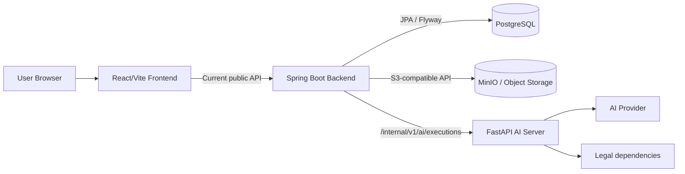

# System Architecture

- Status: CURRENT_AS_BUILT
- Baseline date: 2026-08-04
- Scope: 현재 runtime topology와 서비스 책임

## Current topology

Frontend는 Spring Controller를 호출하며 FastAPI를 직접 호출하지 않는다. Spring은 업무 RDB, 사용자/Project 경계, Object Storage, TaskRun/TaskAttempt/TaskResult와 결과 채택의 source of truth다. FastAPI는 내부 execution request를 검증하고 task dispatcher를 통해 AI·법률 실행 결과를 반환한다.

## Current official Journey boundary

`Idea → AI 해석 → Idea Origin 보완·확정 → Legal Precheck → Legal Guardrail → Concept 생성 → Origin Integrity → Concept Legal Validation → 적격 Concept 3개 표시`

이후 Concept 분석·선택·Persona·Interview·Marketing·Report는 보존된 기존 MVP 실험 기능이며 현재 Journey와 공식적으로 자동 연결하지 않는다.

## Execution topology

- Legal: Persistent Worker가 TaskRun을 claim/start/execute/adopt
- Concept: in-memory Executor가 eligibility batch와 TaskRun을 실행
- 일부 Journey: Service 요청 흐름 안에서 동기 claim/execute/adopt

이를 하나의 실행 방식으로 간주하지 않는다. Spring의 `InternalAiExecutionClient`가 공통 response identity와 canonical hash를 검증하고 각 Service/Worker가 domain invariant를 추가 검증한다.

## Data and migration boundary

Runtime Flyway는 `V1__baseline_schema.sql` 하나다. 과거 SQL V1~V36과 Java V5/V10의 최종 효과를 Baseline V1에 흡수했으며 기존 DB의 in-place upgrade는 지원하지 않는다. 적용 전 기존 PostgreSQL/Docker Volume을 초기화해야 한다. 이후 Schema 변경은 V1을 수정하지 않고 V2 이상 Migration으로 추가한다.

PostgreSQL이 Schema 계약의 기준이다. H2는 일부 Service Test의 격리용이며 Migration 정확성의 증거가 아니다.

## API and CI status

Public API의 현재 실행 권위는 실제 Controller와 Frontend Client다. 기존 `/api/v1` OpenAPI와 현재 `/api/v2` As-Is 문서는 역할을 구분한다.

Repository-local GitHub Actions `CI` workflow가 Frontend lint/baseline/build, Internal AI fixture/pytest, Backend test/postgresTest를 수행한다. 실제 AI Provider·법제처 호출과 전체 Docker E2E는 기본 CI 범위 밖이다.
