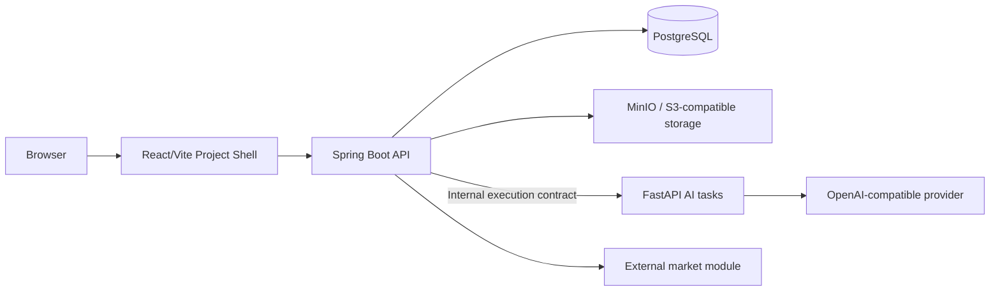

# System Architecture — New Pipeline Baseline

- Status: R7A current baseline
- Baseline date: 2026-08-06

## Ownership boundaries

- Frontend exposes only the new project shell and six pipeline modules.
- Backend owns authentication, projects, files, audit, TaskRun/JobEvent, immutable snapshots,
  module handoff/results, planning decisions, and marketing content state.
- AI exposes only the five new task types: Idea Brief derivation, concept candidate,
  concept legal review, concept redesign, and marketing content generation.
- Provider configuration and structured-output transport live under `ai/app/providers/**`.
- External analysis enters through immutable handoff/result contracts; it does not mutate planning directly.

## Persistence boundary

Flyway starts from `V1__new_pipeline_baseline.sql`. The baseline contains only maintained
foundation and new-pipeline tables. Existing databases must be reset before applying it.

## Removed boundaries

Legacy Journey, document/structured-plan, feasibility, persona/interview/validation,
financial/report, and legacy marketing workspace controllers are not part of the runtime.
`app.legacy-pipeline.enabled` and its conditional surface were removed.
