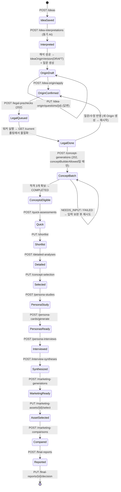

# Journey 상태 전이 명세 (단계 이동 조건)

- Status: **AS_BUILT** — 서비스의 guard 코드와 엔티티 `enum`에서 직접 읽음
- Baseline: 2026-08-05 / `581234a`
- 목적: **흐름**. 값의 스키마는 [`JOURNEY_DATA_CONTRACT.md`](JOURNEY_DATA_CONTRACT.md),
  통신 규약은 [`JOURNEY_API_SPEC.md`](JOURNEY_API_SPEC.md)를 볼 것.

> **우선순위:** 코드 > 이 문서. guard는 서비스의 `context()` / `require*()` 메서드가 정본이다.

---

## 1. 전체 흐름



> **공식 여정과 보존 MVP의 경계:** `PUBLIC_API_V2_CONTRACT.md` 기준으로 공식 여정은
> **`ConceptsEligible`(적격 컨셉 3개 표시)에서 끝난다.** 그 아래
> Quick → Final Report는 구현·라우트·UI가 보존된 기존 MVP 실험 구간이며 자동 연결이 아니다.
> 다만 백엔드 guard는 아래 §5처럼 **실제로 강제되고 있다.**

---

## 2. 실행 패턴이 셋 — 전이가 "언제" 일어나는지가 다르다

| 패턴 | 누가 실행 | 전이 시점 | 사용처 |
|---|---|---|---|
| **A. 동기 인라인** | HTTP 요청 스레드 | **응답 반환 전** | 해석·Quick·Detailed·페르소나·인터뷰·종합·마케팅·리포트 |
| **B. TaskRun 워커** | `@Scheduled` 폴러 (1초) | **다음 `GET /current` 호출 때** | 법률 사전점검만 |
| **C. 인메모리 배치** | `conceptEligibilityExecutor` | **배치 스레드에서 비동기** | 컨셉 적격성만 |

**패턴 B의 지연 반영이 이 시스템에서 가장 헷갈리는 지점이다.**
`LegalPrecheckService.current()` → `synchronize(run)`이 TaskRun 상태를 도메인에 반영하고,
`SUCCEEDED`인데 버전이 없으면 그 시점에 `materialize()`가 `LegalPrecheckVersion`·
`LegalGuardrailSet`을 만든다. **조회하지 않으면 상태가 진행하지 않는다.**

같은 지연 복구가 패턴 A에도 있다: `JourneyAiService.recoverAdoptedResult()` —
`TaskResult`가 `ADOPTED`인데 도메인 run이 미완료면 **AI를 다시 부르지 않고** 결과만 재반영한다.

---

## 3. Readiness — 화면 진행의 신호등

`IdeaOriginService.current()`가 계산해 `ReadinessView`로 내보낸다.
값은 `READY` / `NEEDS_INPUT` / `BLOCKED` 셋이다.

전제:
- `draft` = 최신 `IdeaOriginVersion(DRAFT)`, `confirmed` = 최신 `IdeaOriginVersion(CONFIRMED)`
- `missingOrigin` = `REQUIRED_FOR_IDEA_ORIGIN` 질문 중 `USER_CONFIRMED`가 아닌 것이 있음
- `missingLegal` = `REQUIRED_FOR_LEGAL_PRECHECK` 질문 중 `USER_CONFIRMED`가 아닌 것이 있음
- `currentLegal` = 최신 `LegalPrecheckVersion`이 존재하고 그 `ideaOriginVersion == confirmed`

| 신호등 | 규칙 |
|---|---|
| `ideaOrigin` | `IdeaSource` 없음 → `BLOCKED`<br>`missingOrigin` → `NEEDS_INPUT`<br>`confirmed` 있음 → `READY`<br>`draft` 없음 → `BLOCKED`<br>그 외(draft만 있음) → `NEEDS_INPUT` |
| `legalPrecheck` | `confirmed` 없음 → (`draft` 없으면 `BLOCKED`, 있으면 `NEEDS_INPUT`)<br>`missingLegal` → `NEEDS_INPUT`<br>그 외 → `READY` |
| `conceptBuild` | `currentLegal`이 아님 → `BLOCKED`<br>`legal.conceptBuilderAllowed && !missingLegal` → `READY`<br>그 외 → `NEEDS_INPUT` |

> `IdeaSource`가 아예 없으면 셋 다 `BLOCKED`으로 즉시 반환한다.
> **`conceptBuild`가 `BLOCKED`인 결정적 이유는 "법률 결과가 현재 확정 Origin의 것이 아님"이다** —
> 즉 Origin을 바꾸면 컨셉 단계가 자동으로 잠긴다.

---

## 4. 단계별 상태 머신

### 4-1. `IdeaInterpretationRun`

```
PENDING → RUNNING → SUCCEEDED
                  ↘ FAILED
```

| 전이 | 조건 |
|---|---|
| 시작 | `IdeaSource`가 있어야 함. 없으면 `IDEA_NOT_FOUND` |
| 중복 차단 | 같은 소스의 run이 `PENDING`/`RUNNING`이면 `ANALYSIS_ALREADY_RUNNING` (409) |
| `SUCCEEDED` | 결과 검증 통과 → `IdeaVersion` + `IdeaOriginVersion(DRAFT)` + `IdeaClarificationQuestion` 생성 |
| `FAILED` | 검증 실패(`AI_RESULT_INVALID`) 또는 provider 실패 |

### 4-2. `IdeaOriginVersion`

```
DRAFT → CONFIRMED     (POST /idea-origin/apply)
```

| 전이 | 조건 |
|---|---|
| 답변 저장 | 질문이 **현재 소스의 draft 소속**이어야 함. 아니면 `RESOURCE_NOT_FOUND` |
| 답변 거부 | 이미 그 draft를 기반으로 CONFIRMED가 만들어졌으면 `RESOURCE_VERSION_CONFLICT` (409, retryable) |
| 확정 | `apply(draftVersionId)` — 새 CONFIRMED 버전을 만든다. **DRAFT를 갱신하는 것이 아니다** |

법률 단계에서 되돌아오는 경로가 셋이고, 전부 **새 CONFIRMED Origin을 만든다**:

| 경로 | 만드는 것 | 재시작 |
|---|---|---|
| `/answers/apply` | Origin 1개 | 안 함 |
| `/answers/apply-and-restart` | Origin 1개 | **함** |
| `/versions/{id}/revision-suggestions/{index}/accept` | Origin 1개 (호환용 단건) | 안 함 |
| `/versions/{id}/revision-suggestions/accept` | 선택 category를 반영한 Origin **1개** | **함** |

### 4-3. `LegalPrecheckRun` (패턴 B)

```
QUEUED → RUNNING → SUCCEEDED
                 ↘ FAILED
```

**시작 조건과 멱등성** (`LegalPrecheckService.start`):

같은 `(projectId, ideaOriginVersionId, inputSnapshotHash)`의 Run을 먼저 찾는다.

| 기존 Run 상태 | `POST /legal-prechecks` | `POST /legal-prechecks/refresh` |
|---|---|---|
| `QUEUED` / `RUNNING` | 기존 것 반환 (새로 안 만듦) | 기존 것 반환 |
| `FAILED` + `errorCode == AI_CONFIGURATION_INVALID` | **새 Run 생성** | 새 Run 생성 |
| 그 외 종료 상태 | 기존 것 반환 | **새 Run 생성** (강제) |
| 없음 | 새 Run 생성 | 새 Run 생성 |

`maxAttempts = 3`.

**결과의 `stale` 판정** (`current()`):
```
stale = (현재 확정 Origin이 없음)
      or (run.ideaOriginVersionId != 현재 확정 Origin.id)
      or (run.inputSnapshotHash != 현재 입력의 canonical hash)
```
`stale`이면 화면은 결과를 유효한 것으로 취급하면 안 된다.

**`LegalPrecheckVersion.status`** — 6개 중 하나. 이것 자체가 다음 단계를 결정하지 않고,
**`conceptBuilderAllowed` 불리언이 관문이다.**
```
PASS | PASS_WITH_CONDITIONS | REVISION_REQUIRED
| PROHIBITED | INSUFFICIENT_INFORMATION | EXPERT_REVIEW_REQUIRED
```

### 4-4. `ConceptEligibilityBatch` (패턴 C)

```
GENERATING → VALIDATING_ORIGIN → VALIDATING_LEGAL ─┐
     ↑                                             │
     └───────── 라운드 반복 ─────────────────────────┘
                                     ↓
                    COMPLETED | NEEDS_INPUT | FAILED
```

**진입 guard** (`context(ownerId, projectId, requireLegalPass=true)`) — 전부
`PROJECT_STAGE_INVALID`:
```
origin != null
  && legal != null
  && guardrail != null
  && legal.ideaOriginVersion.id == origin.id     // 현재 Origin의 법률 결과여야 함
  && legal.conceptBuilderAllowed == true
```

**시작 시 재사용 규칙** (`generate`), 키는 `inputSnapshotHash`:

| 기존 배치 | 동작 |
|---|---|
| `FAILED`가 아님 (진행 중 또는 완료) | 기존 배치 반환 |
| `FAILED` + `!retryable` + `errorCode != AI_CONFIGURATION_INVALID` | 기존 배치 반환 (재시도 안 함) |
| 그 외 | **새 배치 생성 후 executor에 제출** |

**루프 종료 조건:**
```
for round in 0..maxReplacementRounds:                  # 기본 2 → 최대 3라운드
    while accepted < targetEligibleCount               # 기본 3
      and sequence < maxInspectedCandidates            # 기본 9
```
설정 키: `CONCEPT_TARGET_ELIGIBLE_COUNT`, `CONCEPT_MAX_REPLACEMENT_ROUNDS`,
`CONCEPT_MAX_INSPECTED_CANDIDATES`.

**후보 1개의 판정 순서:**
1. **origin 무결성** → 실패하면 `ConceptDraft.OriginStatus = FAIL_ORIGIN`, 사유를
   negatives에 넣고 다음 후보로. 법률 검증까지 가지 않는다
2. **중복 fingerprint** → 같은 배치 안에 같은 구조가 이미 있으면
   `DUPLICATE_CONCEPT_STRUCTURE`로 origin 실패 처리
3. **법률 배치 검증** (라운드당 1회, 통과한 후보 묶음) → `PASS`면 accepted,
   `FAIL_LEGAL`이면 reasons + violatedStructureKeys를 negatives에 축적

negatives는 **다음 라운드 생성 프롬프트에 부정 예시로 다시 들어간다.**

**종료 전이:**

| 조건 | 배치 상태 | 부수효과 |
|---|---|---|
| `accepted == targetEligibleCount` | `COMPLETED` | `persistence.publishEligible` — `ConceptVersion`을 `ELIGIBLE`로 발행 |
| 목표 미달로 루프 종료 | `NEEDS_INPUT` | `needsInput` = 중복 제거한 negatives 배열, 생성 run은 `CONCEPT_ELIGIBLE_COUNT_NOT_REACHED`로 실패 |
| 실행 중 입력 해시가 바뀜 | `NEEDS_INPUT` | `["CONCEPT_INPUT_BECAME_STALE"]` |
| `ExecutionFailure` | `FAILED` | `errorCode` + `retryable` 기록 |
| 그 외 런타임 예외 | `FAILED` | `AI_RESULT_INVALID`, `retryable=false` |

**`GET /concepts`가 빈 배열을 주는 조건** (오류가 아니다):
```
배치 없음
| state != COMPLETED
| origin == null | guardrail == null
| batch.inputSnapshotHash != 현재 입력 해시
```

### 4-5. `PersonaStudy`

```
DRAFT → GENERATING → READY
                   ↘ FAILED
```

`requireReadyStudy()` — `READY`가 아니면 `ANALYSIS_INPUT_INVALID`.

### 4-6. `PersonaInterview` / `InterviewSynthesisRun` / 컨셉 AI run

```
PENDING → RUNNING → SUCCEEDED
                  ↘ FAILED
```

`ConceptAiRunBase.State`(Quick·Detailed), `PersonaInterview.State`,
`InterviewSynthesisRun.State`, `LegalReviewRun.State`가 모두 같은 4상태다.

### 4-7. `JourneyMarketingWorkspace` / `JourneyFinalReport`

워크스페이스는 `READY`가 되어야 비교·리포트로 갈 수 있다 (`requireReadyWorkspace`).
최종 리포트는 `PENDING`/`RUNNING`이면 `ANALYSIS_ALREADY_RUNNING`,
같은 `sourceReferenceJson`으로 `SUCCEEDED`한 것이 있으면 **AI 재호출 없이 그대로 반환**한다.

사용자 결정은 AI 결정과 별개 필드로 저장된다 (`aiDecision` vs `userDecision`).

---

## 5. 단계 진입 guard 일람 (백엔드가 실제로 강제하는 것)

각 서비스의 `context()`가 순서대로 검사한다. **먼저 걸린 것이 던져진다.**

### `ConceptJourneyService.context(requireLegalPass)`

| # | 검사 | 실패 코드 |
|---|---|---|
| 1 | 프로젝트가 owner 소유 | `PROJECT_ACCESS_DENIED` |
| 2 | 현재 `IdeaVersion`이 존재하고 `confirmed` | `IDEA_NOT_CONFIRMED` |
| 3 | (`requireLegalPass`) origin·legal·guardrail 존재 + Origin 일치 + `conceptBuilderAllowed` | `PROJECT_STAGE_INVALID` |

### `PersonaJourneyService.context()`

| # | 검사 | 실패 코드 |
|---|---|---|
| 1 | 프로젝트 소유 | `PROJECT_ACCESS_DENIED` |
| 2 | 현재 `IdeaVersion`이 `confirmed` | `IDEA_NOT_CONFIRMED` |
| 3 | `ConceptSelection` 존재 | `PROJECT_STAGE_INVALID` |
| 4 | 선택된 `ConceptVersion`이 이 프로젝트·이 IdeaVersion 소속 | `PROJECT_STAGE_INVALID` |

### `MarketingReportJourneyService.context()`

| # | 검사 | 실패 코드 |
|---|---|---|
| 1 | 프로젝트 소유 | `PROJECT_ACCESS_DENIED` |
| 2 | 현재 `IdeaVersion`이 `confirmed` | `IDEA_NOT_CONFIRMED` |
| 3 | `ConceptSelection` 존재 | `PROJECT_STAGE_INVALID` |
| 4 | 선택 `ConceptVersion` 조회 가능 | `PROJECT_STAGE_INVALID` |
| 5 | `PersonaStudy` 존재 | `ANALYSIS_INPUT_INVALID` |
| 6 | 최신 `InterviewSynthesisRun`이 `SUCCEEDED` | `ANALYSIS_INPUT_INVALID` |
| 7 | **종합이 참조한 인터뷰 ID 집합 == 현재 인터뷰 ID 집합** | `ANALYSIS_INPUT_INVALID` |
| 8 | 종합 결과 엔티티 존재 | `ANALYSIS_INPUT_INVALID` |

**#7이 이 시스템의 핵심 무효화 규칙이다.** 인터뷰를 하나라도 다시 돌리면 기존 종합이
자동으로 무효가 되고, 마케팅·리포트 단계가 잠긴다.

### 단계별 추가 guard

| 단계 | 추가 조건 | 실패 코드 |
|---|---|---|
| Quick | 적격 컨셉이 1개 이상 | `ANALYSIS_INPUT_INVALID` |
| Shortlist | Quick run이 `SUCCEEDED`<br>`conceptVersionIds`가 비지 않고 **전부** 이 프로젝트·IdeaVersion 소속 | `ANALYSIS_INPUT_INVALID` |
| Detailed | Shortlist 존재<br>`financials`의 개수·ID 집합이 shortlist와 **정확히 일치**<br>`unitPrice > 0`, `unitPrice > variableCostPerCustomer`, 나머지 ≥ 0 | `ANALYSIS_INPUT_INVALID` |
| Selection | `reason`·`conceptVersionId` non-null<br>선택 컨셉이 **최신 성공 Detailed run에 포함**되어 있음 | `ANALYSIS_INPUT_INVALID` |
| Interview | Study가 `READY`<br>`personaCardVersionIds`가 비지 않고 전부 조회되며 **전부 이 Study 소속** | `ANALYSIS_INPUT_INVALID` |
| Synthesis | Study `READY`<br>선택된 페르소나가 1개 이상<br>**선택된 페르소나 전원의 최신 인터뷰가 `SUCCEEDED`** | `ANALYSIS_INPUT_INVALID` |
| Final Report | 워크스페이스 `READY`<br>최신 Comparison run이 `SUCCEEDED`<br>**선택된 자산이 1개 이상**<br>성공한 Detailed run 존재<br>성공한 `LegalReviewRun` 존재 | `ANALYSIS_INPUT_INVALID`<br>(법률만 `LEGAL_REVIEW_NOT_FOUND`) |
| Decision | `decision`이 허용 집합 안<br>공백 제거 후 `reasons` 1개 이상 | `ANALYSIS_INPUT_INVALID` |

---

## 6. 무효화(invalidation) 규칙 — 되돌아가면 무엇이 잠기는가

이 시스템에는 "명시적 롤백"이 없다. 대신 **해시·ID 일치 검사가 하류를 자동으로 잠근다.**

| 사용자가 한 일 | 잠기는 것 | 메커니즘 |
|---|---|---|
| 새 Origin 확정 | 법률 결과가 `stale`, `conceptBuild`가 `BLOCKED` | `legal.ideaOriginVersionId != confirmed.id` |
| Origin 입력 변경 (같은 버전이라도) | 법률 결과가 `stale`, 컨셉 배치가 `stale` | `inputSnapshotHash` 불일치 |
| 컨셉 재생성 | `GET /concepts`가 빈 배열 (배치가 `COMPLETED`가 될 때까지) | 배치 상태 검사 |
| 인터뷰 재실행 | 종합·마케팅·리포트 전부 차단 | 종합의 `interviewIdsJson` != 현재 인터뷰 ID 집합 |
| 마케팅 자산 선택 변경 | 기존 최종 리포트 재사용 불가 → 새로 생성 | `sourceReferenceJson`에 선택 자산 ID가 들어감 |

**즉, 하류 단계는 상류의 스냅샷 해시/ID를 들고 있고, 그것이 어긋나는 순간 스스로 무효가 된다.**
새 단계를 추가할 때도 같은 방식으로 상류를 참조해야 한다.

---

## 7. TaskRun — 모든 AI 실행의 하부 상태 머신

도메인 상태와 **별개로** 아래 3층이 항상 남는다.

```
TaskRun      QUEUED → READY → RUNNING → SUCCEEDED | FAILED | TIMED_OUT | CANCELLED
TaskAttempt  CREATED → CLAIMED → RUNNING → SUCCEEDED | FAILED | TIMED_OUT | CANCELLED
TaskResult   ADOPTED | REJECTED
```

**채택은 정확히 한 번이다.** `TaskRunService.adopt()`가
```
state == RUNNING && finalResultId == null && attemptId == currentAttemptId
```
을 확인하고, 어긋나면 결과를 `REJECTED`로 저장한 뒤 `LATE_OR_DUPLICATE_RESULT`로 실패시킨다.
네트워크 모호성으로 AI 실행이 중복될 수 있음을 전제로 설계돼 있다.

한 사이클:
```
① taskRuns.create(...)      멱등/중복 검사 후 INSERT
② claim()                   TaskAttempt 생성, claimToken 발급
③ startExecution()          attempt RUNNING
④ HTTP 호출                 ← 반드시 DB 트랜잭션 밖
⑤ 응답 검증                 패턴 A: 호출한 서비스 / 패턴 B: TaskRunWorker.validateResult()
⑥ adopt() 또는 rejectAndFail()
⑦ persistence.complete(...)  별도 @Transactional
```

`TaskRunWorker.execute()`가 `TransactionSynchronizationManager.isActualTransactionActive()`를
확인하고 켜져 있으면 `IllegalStateException("AI call must run outside a DB transaction")`을
던진다. 그래서 ①②③⑥⑦이 각각 짧은 트랜잭션으로 쪼개져 있다.

---

## 8. 지뢰

1. **`TaskRunWorker.validateResult()`는 3개 TaskType만 안다** —
   `IDEA_INTERPRETATION` · `IDEA_LEGAL_PRECHECK` · `CONCEPT_LEGAL_VALIDATION`.
   패턴 B로 새 타입을 돌리면서 여기를 안 고치면 **AI 호출은 성공하고 결과만 조용히 버려진다**
   (`RESULT_DOMAIN_INVARIANT_VIOLATION`).
2. **법률 결과는 조회해야 진행한다.** `GET /legal-prechecks/current`를 부르지 않으면
   `LegalPrecheckVersion`이 만들어지지 않는다.
3. **`stale`은 오류가 아니다.** 화면이 오류로 처리하면 사용자가 막힌다. "다시 실행" 유도가 맞다.
4. **`GET /concepts`의 빈 배열도 오류가 아니다.**
5. **AI 호출은 트랜잭션 밖.** 도메인 서비스 메서드에 `@Transactional`을 통째로 붙이면 런타임 예외.
6. **인터뷰를 다시 돌리면 마케팅·리포트가 통째로 잠긴다** (§5 #7). 의도된 동작이다.
